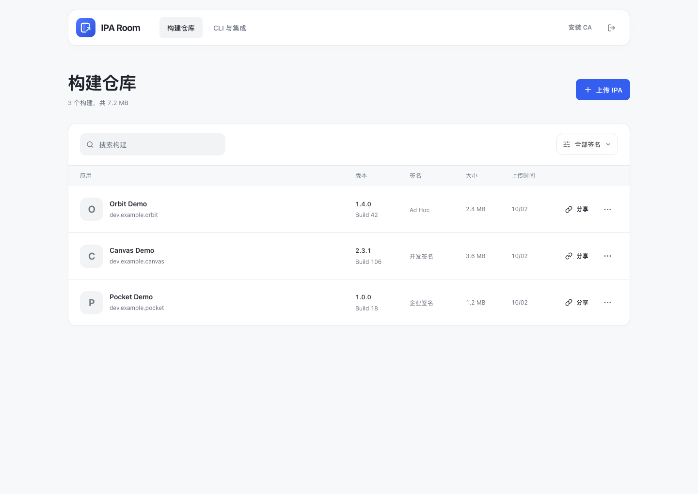
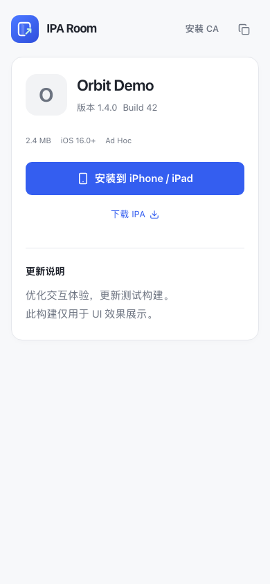

<div align="center">
  
  <h1>IPA Room</h1>
  <p><strong>让测试构建，轻松抵达设备。</strong></p>
  <p>自托管的局域网 iOS 构建分发工具，连接网页、命令行与 AI Agent。</p>
  <p>
    <a href="./LICENSE"></a>
    
    
  </p>
  <p><a href="./README.md">简体中文</a> · <a href="./README.en.md">English</a></p>
  <p><a href="#快速开始">快速开始</a> · <a href="#cli">CLI</a> · <a href="#独立-mcp">MCP</a> · <a href="#局域网配置和部署">部署</a> · <a href="#开发与贡献">参与贡献</a></p>
</div>

<picture>
  <source media="(prefers-color-scheme: dark)" srcset="./docs/assets/dashboard-dark.png" />
  
</picture>
<p align="center"><sub>界面截图使用示例构建。工作台支持深色模式、手机布局和键盘操作。</sub></p>

<details>
  <summary>查看手机安装页</summary>
  <p align="center"></p>
</details>

## 为什么选择 IPA Room

从 Xcode 导出的 IPA 到设备上的安装入口，IPA Room 把构建整理、链接分享与局域网托管放在一个工作空间里。

CLI 与 MCP 返回的 `installUrl` 直接打开该构建的独立单页（`/s/<token>`），无需进入仓库或登录。构建信息和安装／下载入口由服务端渲染，禁用 JavaScript 也可访问；分享页不提供返回工作台的入口。界面用文字呈现统计与签名信息，减少状态点和彩色标签。

| 能力         | 你可以做什么                                                               |
| ------------ | -------------------------------------------------------------------------- |
| 构建仓库     | 上传 IPA，自动读取版本与签名信息，按应用、版本或签名类型查找构建           |
| 链接分发     | 分享安装页和二维码，按需轮换或撤销链接；受信任的 HTTPS 下提供 iOS OTA 入口 |
| 独立 CLI     | 一条命令启动临时分发页，也可上传到常驻服务、导出 Xcode Archive 或接入 CI   |
| MCP 与 Skill | 通过 stdio / Streamable HTTP 为 Agent 提供分发工具，配套安装与验证 skill   |
| 局域网自托管 | IPA 与 SQLite 保存在自己的服务器，支持 Docker 和 Caddy 内网 HTTPS          |
| 现代工作台   | 悬浮导航、简洁列表、CA 安装快捷入口，适配手机与系统深色模式                |

技术栈：**SvelteKit · Svelte 5 · Bits UI · SCSS · Node.js · SQLite**。

## 快速开始

要求 Node.js 24+、pnpm 12。

```sh
git clone https://github.com/backrunner/iparoom.git
cd iparoom
pnpm install
pnpm cli config
# 编辑 ~/.iparoom/config.yaml，设置 server.adminToken（随机且至少 24 字符）
pnpm dev
```

运行后终端会显示 HTTPS 地址，例如 `https://192.168.1.10:5173`，以及首次安装 CA 的 HTTP 入口和 SHA-256 指纹。默认自动创建本机 CA（需要 OpenSSL），按下文「CA 与 HTTPS」完成信任后访问工作台，用配置的 Token 登录。管理员会话有效期 7 天；API 使用 Bearer Token。未配置有效 Token 时，管理接口拒绝请求。HTTP 可以上传和下载。iOS OTA 需要设备可访问、证书被 iOS 信任的 HTTPS；服务可以只在局域网运行，无需对公网开放。

生产运行先构建，再启动服务：

```sh
pnpm build
pnpm start
```

`pnpm dev`、`pnpm start`、CLI 和 MCP 共用 `~/.iparoom/config.yaml`。默认监听所有 IPv4 网卡；开发端口由 `server.devPort` 控制，常驻端口由 `server.port` 控制。`server.hostname` 指定分享域名或 IP，留空时优先使用可靠查询到或显式配置的 Surge Ponte 域名，否则选择本机私有 IPv4。`server.baseUrl` 可设置 HTTPS 反代的完整根地址。修改后重启服务并使用新链接/二维码；直接运行 `node build` 是 HTTP 后端，需要自行设置监听端口和反代根地址。

## 配置与用户数据

首次启动自动创建 `~/.iparoom/config.yaml`，也可用 `iparoom config`（源码中 `pnpm cli config`）创建并打印路径。所有持久化配置都在这份 YAML 中，完整字段见 [`config.example.yaml`](./config.example.yaml)。例如：

```yaml
version: 1
server:
  hostname: 192.168.1.10
  port: 8443
  adminToken: '替换为至少24字符的随机Token'
https:
  enabled: true
  caPort: 8080
ponte:
  hostname: '' # 已知真实 Ponte 域名时填写 my-mac.sgponte
share:
  openBrowser: false
```

未填写字段使用默认值。配置文件和私钥权限为 0600，`.iparoom` 目录为 0700。证书保存在 `~/.iparoom/certificates`，SQLite 和常驻 IPA 默认位于 `~/.iparoom/data`；临时分享的 IPA 随会话清理。相对证书与存储路径以 `.iparoom` 为基准，和启动工作目录无关。

`IPAROOM_USER_DATA_DIR=/path/to/userdata` 会统一使用 `/path/to/userdata/.iparoom/config.yaml`、`certificates` 和 `data`，传入的是 **userdata 根目录**。优先级为显式 CLI 参数 → 环境变量 → YAML → 默认值；端口字段分别为 `server.port` / `server.devPort`、`share.port` 和 `mcp.port`，常驻 `PORT` 可以临时覆盖服务端口。修改 YAML 后需重启对应服务、CLI 或 MCP；已运行进程不会自动变更监听端口或证书。

首次创建 YAML 时迁移旧 `~/.config/iparoom/config.json` 的登录凭据及旧 CA；本地 `pnpm dev/start` 和 `pnpm docker` 也会迁移项目 `.env` 中的已知 IPA Room 配置。原文件保留作备份，后续只读取 YAML，不继续写旧目录。已迁移 CA 的指纹不变，无需重新信任根证书；旧 `IPAROOM_CONFIG_DIR` / `IPAROOM_CERT_DIR` 仅用来寻找迁移源。已有 YAML 不被旧配置覆盖。

## CLI

### 一行启动页面

先安装携带网页服务的 CLI 包：

```sh
pnpm pack:cli
npm install -g ./dist/iparoom-cli-0.1.0.tgz
```

之后在任意目录执行：

```sh
iparoom ./MyApp.ipa
iparoom "/path/App with spaces.ipa" --notes "本周测试构建"
iparoom ./exports --no-open
```

无需提前启动服务、配置 Token 或登录。CLI 默认监听所有 IPv4 网卡，自动选择本机内网 IPv4 作为链接地址并分配空闲端口，导入 IPA，打开这个构建的安装页，并在终端显示局域网链接与二维码。目录参数需包含唯一的 IPA。命令保持前台运行，按 Ctrl+C 正常停止后关闭服务并删除临时副本；原始 IPA 不受影响。关闭后这次临时链接不可用。此模式不读取当前目录 `.env`，也不使用已保存的远程登录凭据。

默认启用本机 CA 签发的 HTTPS，右上角「安装 CA」可下载根证书配置文件。CA 保存在独立目录，停止临时分享不会删除它。已有组织证书时可显式传入证书链与公有根证书：

```sh
iparoom ./MyApp.ipa --hostname ipa.lan --port 8443 \
  --cert ./server.crt --key ./server.key --ca ./root.crt
```

`--host` 默认 `0.0.0.0`，也可指定本机 IPv4；`--hostname` 指定链接域名，设备 DNS 或 hosts 必须能把它解析到服务器，证书需覆盖该 hostname；`--port` 默认 0（自动选择空闲端口）；`--no-open` 禁止自动打开浏览器；`--json` 输出启动结果且不打印终端二维码。独立包包含编译后的 SvelteKit 页面与服务代码，只需 Node.js 24+ 和 OpenSSL（自备证书时无需自动签发），无需安装 Xcode 来分享已导出的 IPA。CLI 尚未发布到 npm，当前使用本地 tarball 安装。

### 上传到常驻服务

已有局域网服务时，可以保留构建历史、撤销链接与管理版本：

```sh
iparoom login --server https://192.168.1.10:8443
# 交互式输入管理 Token（隐藏输入）；非交互环境用 IPAROOM_TOKEN。
iparoom upload ./exports/MyApp.ipa --notes "本周测试版本"
iparoom upload ./exports --json
iparoom list
iparoom info <build-id> --json
iparoom share <build-id> --revoke
iparoom share <build-id>  # 生成新链接，旧链接失效
iparoom delete <build-id> --yes
iparoom logout
```

仓库中可用 `pnpm cli ...`。源码链接安装需要先 `pnpm build:cli`，再执行 `cd packages/cli && npm link`。

### Xcode Archive 导出与上传

```sh
iparoom export ./MyApp.xcarchive \
  --options ./ExportOptions.plist \
  --output ./exports \
  --notes "回归测试"
```

CLI 使用参数数组调用 `xcodebuild -exportArchive`，成功后上传。输出目录若已有 IPA 会拒绝导出，请为本次构建使用新目录，防止误上传旧包。导出选项应使用项目自身或 Xcode Organizer 生成的 ExportOptions.plist；证书、账号和描述文件由本机 Xcode 管理。本服务不签名、不重签名、不采集开发者账号。

### CI

将 `IPAROOM_SERVER` 和 `IPAROOM_TOKEN` 注入流水线，使用 `iparoom upload ./exports --json`。JSON 写入 stdout，进度与 Xcode 日志写入 stderr，失败退出码为 1。Token 不放在命令参数中；本地登录凭据保存在 `~/.iparoom/config.yaml` 的 `client` 字段，权限为 0600。`login/logout` 只更新凭据，保留其他配置和注释。CLI 不跟随重定向，避免携带认证到重定向目标。

## 独立 MCP

CLI 包同时提供 `iparoom mcp` 和独立的 `iparoom-mcp` 可执行入口。MCP 自带临时 IPA 网页服务，不依赖已经运行的 IPA Room、管理 Token 或远程登录。默认 stdio 供 agent 作为子进程拉起；stdout 只输出 MCP 协议，日志写 stderr。

```sh
iparoom mcp --hostname ipa.lan --port 8443 --cert ./server.crt --key ./server.key --ca ./root.crt
# 等价的独立命令
iparoom-mcp --hostname ipa.lan --port 8443 --cert ./server.crt --key ./server.key --ca ./root.crt
```

agent 的通用 MCP 配置示例（默认自动生成 HTTPS 证书）：

```json
{
  "mcpServers": {
    "iparoom": {
      "command": "iparoom-mcp",
      "args": []
    }
  }
}
```

工具支持一个会话分享多个 IPA，返回结构化构建信息、安装页、下载 URL、manifest、OTA URL、SHA-256 和监听地址：

| 工具                        | 参数             | 用途                            |
| --------------------------- | ---------------- | ------------------------------- |
| iparoom_create_install_link | path、可选 notes | 导入 MCP 主机上的 IPA，生成链接 |
| iparoom_list_builds         | 无               | 查询此 MCP 会话的构建           |
| iparoom_get_install_link    | id               | 读取现有链接，不轮换            |
| iparoom_revoke_share        | id               | 撤销分享                        |
| iparoom_server_status       | 无               | 查询 hostname、监听地址和端口   |

hostname 是启动配置，所有工具生成的安装页、manifest 和 IPA 地址使用同一 hostname。`--host` 默认 `0.0.0.0`；`--port` 是 IPA 网页端口，默认随机空闲端口。证书 hostname 和私钥不匹配时拒绝启动。工具不修改原文件，也不声称真机安装完成。stdio 输入关闭、Ctrl+C 或 SIGTERM 会关闭服务并删除临时副本，链接随之失效；交付给用户时保持 MCP 进程存活。

需要其他局域网 agent 连接时，可独立启动 **Streamable HTTP MCP**：

```sh
# IPAROOM_MCP_TOKEN 由环境/Secret 管理器提供，至少 24 字符
iparoom-mcp --transport http --hostname ipa.lan --mcp-port 3001
```

MCP 地址默认为 `https://ipa.lan:3001/mcp`，客户端发送 `Authorization: Bearer <IPAROOM_MCP_TOKEN>`；`--mcp-port` 与 IPA 网页端口分开。默认两个端口都使用同一 CA 签发的 HTTPS 证书；客户端用 `NODE_EXTRA_CA_CERTS` 信任根证书。`--http` 可显式使用 HTTP。HTTP MCP 采用无状态 POST 请求，校验 Host/Origin，限制请求体为 64 KiB；stdio 不需要 MCP Token。`path` 是 **MCP 服务主机**上的文件路径，不能用调用者电脑的路径代替。CLI/MCP 独立模式不加载项目 `.env`，共用 userdata 中的 YAML，并允许参数或环境变量临时覆盖。

### 添加到 Agent 客户端

安装 CLI 包后，可添加用户级 stdio MCP：

```sh
codex mcp add iparoom -- iparoom-mcp
claude mcp add --scope user --transport stdio iparoom -- iparoom-mcp
gemini mcp add --scope user --transport stdio iparoom iparoom-mcp
```

GUI 客户端不一定继承终端的 nvm/PATH。此时将 `command` 配置为 Node 24+ 的绝对路径，将 `args` 配置为已安装包中 `bin/iparoom-mcp.mjs` 的绝对路径；需要 hostname/证书时继续追加对应参数。在客户端刷新 MCP 或开启新会话，并确认五个工具可用。Gemini 只会在受信任目录中启用配置；保留客户端现有的工具审批与目录信任设置。

## Agent Skill

配套 skill [`iparoom-install`](./skills/iparoom-install/SKILL.md) 指导 agent 完成 Xcode 导出、局域网临时分享/常驻上传、内网 HTTPS 与设备信任、文件完整性检查和真机结果确认。

```sh
# 安装包携带 skill；默认安装到 $CODEX_HOME/skills 或 ~/.codex/skills
iparoom skill install
# 自定义的是 skills 父目录
iparoom skill install --path /path/to/agent/skills --json
# 从源码直接安装
pnpm skill:install
```

在支持 skills 的 agent 新任务中使用：`使用 $iparoom-install 把 ./App.ipa 安装到局域网测试 iPhone，检查安装入口和实际安装结果。`

skill 启用默认自动发现，附带 Python 3 标准库校验脚本（无需 pip）：验证页面、HEAD/Range、HTTPS plist manifest 与 SHA-256。HTTP 校验不会声称 OTA 可用，网络验证不会声称真机安装完成。相同版本重复安装可直接成功；目标目录已有不同内容时保留原 skill 并提示审查，不自动覆盖本地定制。

## CA 与 HTTPS

`pnpm dev`、`pnpm start`、独立 CLI 和 MCP 默认使用同一套本机 CA 机制。首次生成需要系统 `openssl`。根 CA 有效期 10 年，RSA 3072 / SHA-256；服务证书有效期 90 天，RSA 2048 / SHA-256、`CA:FALSE`、`serverAuth`，SAN 覆盖访问 hostname、本机局域网 IP、localhost / 127.0.0.1，以及已知 Ponte 域名。证书临近到期在下次启动时续签，CA 不变；CA 临近到期或证书/私钥不匹配会拒绝启动，不静默更换已信任的根。

CA 统一位于 userdata 下的 `.iparoom/certificates`，默认 `~/.iparoom/certificates`；通过 `IPAROOM_USER_DATA_DIR` 一起调整配置、证书和默认数据位置。目录权限 0700，私钥 0600，不进入 IPA 数据目录、网页下载、安装配置文件或发布包。并发签发使用锁；异常终止留下锁时，确认没有正在签发的进程后，按报错中的路径清理 `.issuance-lock`。备份 CA 时保留私钥；选择另一份用户数据且不保留原 CA 意味着设备需要安装并信任新的根。

首次在设备 Safari 打开终端打印的 `http://<hostname>:<CA端口>/ca`，确认页面 SHA-256 指纹与终端一致，下载 `.mobileconfig`。在「设置 → 通用 → VPN 与设备管理」安装后，再到「设置 → 通用 → 关于本机 → 证书信任设置」开启完全信任。然后打开 HTTPS 构建链接。右上角入口同样指向这个证书页；配置文件只含公开根证书，不含私钥、SCEP 或设备管理载荷。HTTP 证书端口不提供登录、管理 API、IPA 或目录浏览，可用 YAML 的 `https.caPort`（或 `--ca-port` / `IPAROOM_CA_PORT` 临时覆盖）固定端口。

CLI/MCP JSON 额外返回 `certificateInstallUrl`、`caCertificatePath`、`caFingerprint`、`managedCertificates` 和 Ponte 检测结果。HTTP 下载模式用 `--http`；本地常驻服务用 `https.enabled: false`，也支持 `IPAROOM_HTTPS=0` 临时覆盖或显式 HTTP 根地址。组织证书使用 `--cert/--key`，提供 `--ca` 时会验证完整链并启用该根的安装入口；YAML 对应字段为 `https.certificate`、`https.privateKey`、`https.caCertificate`，相应环境变量仍支持临时覆盖。由公共 CA 签发且设备已信任的证书无需自定义 CA 入口。

### Surge Ponte

启动时只读取 Surge CLI `--raw status`，使用其中明确报告的本机 Ponte 身份，**不把 macOS 设备名猜成 Ponte 名称**，不读取 Surge 配置或密钥。部分 Surge 版本未在此接口报告 Ponte 名称，此时自动回退到局域网 IP。已知实际域名时配置 YAML `ponte.hostname: my-mac.sgponte`（或环境变量 `IPAROOM_PONTE_HOSTNAME`），也可使用 `--ponte-hostname my-mac.sgponte`：默认分享地址优先使用它，同时服务证书保留局域网 IP SAN。显式 `--hostname` / `IPAROOM_HOSTNAME` / 根地址优先；`--no-ponte` / `IPAROOM_PONTE=0` 可关闭自动选择。

`.sgponte` 由 Surge 解析，需要客户端已启用 Surge Ponte 并具备访问权限；普通 DNS 不提供它。`pnpm docker` 在宿主机查询，容器本身不能查询 Surge；也可在 YAML `server.hostname` 中显式填写真实 Ponte 域名。Ponte 访问和设备 CA 信任是真机条件，TLS 单元/网络测试不会证明它们已完成。

参考：[Surge Ponte](https://manual.nssurge.com/features/ponte.html)、[Apple 根证书信任](https://support.apple.com/en-us/102390)。

## 局域网部署

Docker 同样读取 `~/.iparoom/config.yaml`。需要 Node.js 24+、已安装项目依赖及 Docker Compose 2.24.4+（支持 `!reset`）；在仓库中执行：

```sh
pnpm docker up -d --build
pnpm docker logs --tail 50
pnpm docker down
```

默认使用 Caddy 内网 HTTPS，公开端口来自 `server.port`（默认 3000），CA 端口来自 `https.caPort`（0 时使用 8080）；`server.host` 控制绑定地址。将 `server.hostname` 设为设备可解析的域名或内网 IP，例如 `192.168.1.10`，并配置随机 `server.adminToken`。默认入口为 `https://192.168.1.10:3000` 和 `http://192.168.1.10:8080/ca`。`server.baseUrl` 如有设置，必须与 hostname、公开端口和 HTTPS 模式一致。

`https.enabled: false` 则只启动 HTTP 管理/下载服务，入口为 `http://192.168.1.10:3000`，不提供 OTA。修改后重新执行 `pnpm docker up -d --build`；入口默认增加 `--force-recreate`，确保编辑器原子保存或 CLI 保存后，容器重新挂载新的 YAML 文件。普通 `docker restart` 无法刷新已替换文件的挂载。独立 `docker-compose` 可通过 `IPAROOM_DOCKER_COMMAND=/path/to/docker-compose` 使用同一入口。

配置文件以只读方式绑定到应用容器，常驻数据映射到 YAML 的 `storage.dataDir`。Caddy 的 CA 和运行数据位于 `~/.iparoom/caddy/data`，运行配置位于 `~/.iparoom/caddy/config`；应用容器不挂载 CA 私钥，只通过内部网络取公开根证书。Docker 的 Caddy CA 与本机 OpenSSL CA 是独立的，首次分别核对安装页指纹。旧 Docker 命名卷保留，不会自动搬移；升级前应备份并将旧 IPA/SQLite 数据复制到新的数据目录，旧 Caddy `/data` 复制到 `.iparoom/caddy/data`，保留其受信任根。

Caddy 生成根证书后，在设备 Safari 打开 HTTP `/ca` 或使用 HTTPS 页右上角「安装 CA」；安装 `.mobileconfig` 后到「设置 → 通用 → 关于本机 → 证书信任设置」开启完全信任，再打开 HTTPS 构建链接。只分发公开根证书。

Node CLI 可仅为当前进程指定对应根证书，无需改系统信任：

```sh
pnpm docker cp caddy:/data/caddy/pki/authorities/local/root.crt "$HOME/.iparoom/caddy-root.crt"
NODE_EXTRA_CA_CERTS="$HOME/.iparoom/caddy-root.crt" \
  pnpm cli login --server https://192.168.1.10:3000
```

已有组织 CA/反代时可使用 `pnpm start` 的自备证书配置，或直接 HTTP 后端，并设置 `server.baseUrl`。证书必须覆盖设备实际访问的 IP/域名。

单实例部署，SQLite 使用 WAL，持久化配置、证书和构建数据需备份。最多两个并发上传，流式写入并计算 SHA-256。修改管理 Token 会使已有会话失效。设备与服务器必须互通，Wi-Fi 客户端隔离可能阻止连接。

参考：[Caddy 内网 HTTPS](https://caddyserver.com/docs/automatic-https#local-https)、[Apple 根证书信任设置](https://support.apple.com/en-us/102390)。

## 安装与调试边界

- 在同一局域网的 iPhone / iPad Safari 中打开安装页，或扫描二维码。
- 服务仅在内网托管；某些签名的首次验证仍可能需要设备访问 Apple 服务，内网托管不等于完全离线安装。
- Ad Hoc / Development 签名通常要求设备 UDID 已在描述文件中；企业分发受 Apple Enterprise Program 的授权限制。
- App Store 导出包不适用这里的 OTA 安装，请使用 TestFlight / App Store。
- 签名类型与到期时间从 embedded.mobileprovision 读取，仅是提示，服务不验证证书链、代码签名或设备可安装性。未知签名、过期描述文件、HTTP 配置和 App Store 包不展示 OTA 按钮，仍可下载 IPA。
- 远程分发 IPA 不是远程连接 LLDB。断点、实时日志等调试仍需 Xcode 支持的设备连接方式。
- 分享 URL 是持有即访问的随机能力链接，持有者能下载整个构建。撤销/旋转同时使旧安装页、manifest、下载 URL 对后续请求失效；已开始的下载或设备上已安装的应用不受影响。

参考：[Apple 无线分发说明](https://support.apple.com/en-gb/guide/deployment/depce7cefc4d/1/web)、[SvelteKit Node 部署](https://svelte.dev/docs/kit/adapter-node)。

无需网页 HTTPS 时，可将 IPA 通过局域网 HTTP 下载到 Mac，再使用 Xcode / Device Hub 或 Apple Configurator 安装到已连接的目标设备。具体操作与后续 CLI 设计见 [设备安装方案](./skills/iparoom-install/references/nonhttps-installation.md)。自动 `iparoom devices` / `iparoom install` 目前尚未实现。

## API

所有 `/api/builds*` 请求都需要管理会话或 `Authorization: Bearer <token>`。

| 方法     | 路径                     | 行为                                                                  |
| -------- | ------------------------ | --------------------------------------------------------------------- |
| POST     | /api/builds              | 原始 IPA 字节流；X-IPAROOM-Notes 为 encodeURIComponent 编码的更新说明 |
| GET      | /api/builds              | 构建列表，包含分享链接                                                |
| GET      | /api/builds/:id          | 元信息与链接                                                          |
| DELETE   | /api/builds/:id          | 删除构建和文件                                                        |
| POST     | /api/builds/:id/share    | JSON `{ "enabled": true/false }`；true 生成新链接，false 撤销         |
| GET      | /s/:token                | 安装页，不需要登录                                                    |
| GET      | /s/:token/manifest.plist | OTA manifest，只允许 HTTPS 配置                                       |
| GET/HEAD | /s/:token/download       | IPA 下载，支持单段 Range                                              |

测试使用合成 IPA 验证上传/解析/manifest/下载/CLI/UI；合成包不包含有效代码签名，不能作为真机安装证据。实际 OTA 安装需要你导出的有效签名 IPA、受信任的局域网 HTTPS 和受支持的测试设备。

## 开发与贡献

欢迎提交 [Issue](https://github.com/backrunner/iparoom/issues) 或 Pull Request。修改前按「快速开始」安装依赖；涉及界面、CLI 或分发行为的变更，请一并更新中英文文档，并在 PR 中说明验证结果。

```sh
pnpm check
pnpm test
pnpm build
pnpm exec playwright install chromium
pnpm test:e2e
pnpm format:check
```

界面测试使用合成 IPA，覆盖上传、搜索、签名筛选、分享链接管理、下载和手机布局。真机安装结果需要单独验证。

## 许可证

Copyright 2026 IPA Room contributors.

本项目基于 [Apache License 2.0](./LICENSE) 开源。CLI 分发包包含同一份完整许可证。
